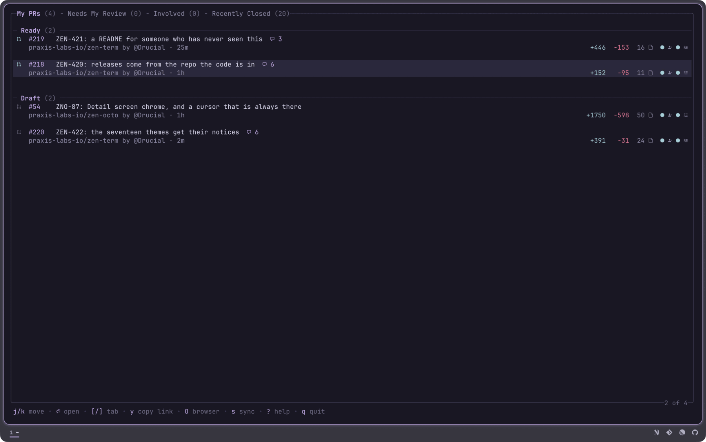
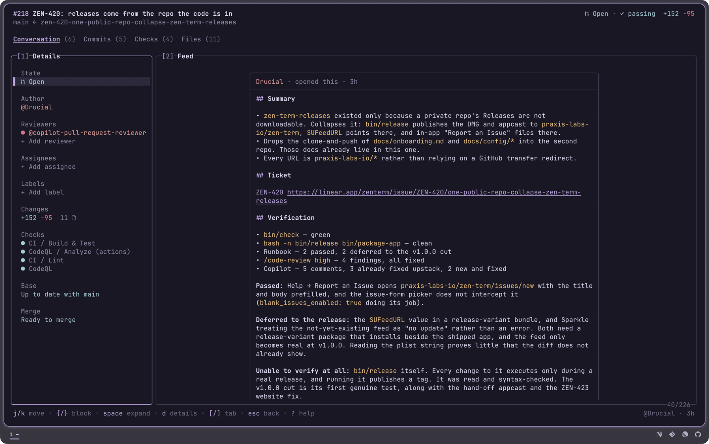
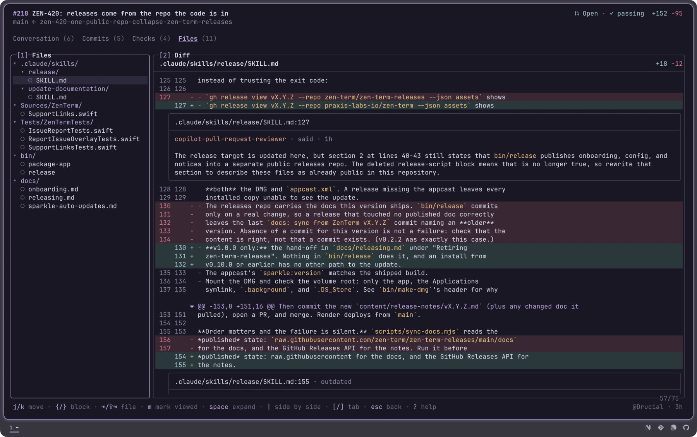

# zen-octo

A terminal client for GitHub, built for the part of the day spent in other
people's branches.

A pull request opens as four tabs: the conversation as threaded cards, the diff,
the commits, and the CI logs. Reply, quote, edit, react and resolve on any
thread. Comment on the line the cursor is on. Search a job's log and jump to its
first failure. Set the state, labels, reviewers, assignees and base branch from a
rail beside it, then merge with the commit message GitHub itself would write.

This is v0.2.0, an early release ahead of a launch. It does not submit a review,
check a branch out, or list issues. Those still go through `gh` or the browser.

The keymap, the install path and the docs are shared with the other zen tools,
so learning one teaches you the next.

Needs the [GitHub CLI](https://cli.github.com) authenticated. zen-octo rides on
`gh`'s token rather than asking for one of its own.



You open on a list divided into sections, each one a GitHub search query you
wrote. What is on screen is whatever you told it to watch.



`⏎` opens one. The rail down the left carries five writes: state, labels,
reviewers, assignees and the base branch. It answers at every width the shell
will draw, so the writes hold in a drawer beside an editor.



`]` and `[` walk the four tabs. On Files the tree is beside the diff, review
comments sit against the lines they were written on, and `c` adds one scoped to
the line under the cursor. `\|` splits the diff into two columns, and `?` lists
the keys.

## Install

```sh
curl -fsSL https://raw.githubusercontent.com/praxis-labs-io/zen-octo/main/install.sh | sh
```

Downloads the binary for macOS or Linux, on arm64 or amd64, and needs no Go.
Windows takes the `.zip` off the
[releases page](https://github.com/praxis-labs-io/zen-octo/releases), the
installer being a POSIX script.

From a clone, which is what you want if you intend to change anything:

```sh
git clone https://github.com/praxis-labs-io/zen-octo.git
cd zen-octo
make install
```

That one needs Go 1.26.6 or later. [Install](docs/install.md) covers the
requirements, the config path and upgrading.

## A first run

```sh
zen-octo
```

You land on a list of pull requests, divided into sections you defined: yours,
the ones wanting your review, the ones you are involved in. Each section is a
GitHub search query, so the list is whatever you told it to watch.

`⏎` opens one. Four tabs from there, walked with `]` and `[`: the conversation,
the files, the commits, and the checks. `}` and `{` walk the blocks on whichever
tab you are on, which means cards on the conversation and hunks on the files.

`c` comments, `r` replies, `+` reacts, `x` resolves a thread. `d` opens the
details rail: state, labels, reviewers, assignees and the base branch, each
behind a picker.

`?` lists the keys without leaving the app.

## Documentation

- [Guide](docs/guide.md): the list, the four tabs, the rail, merging
- [Keys](docs/keys.md): every binding, generated from the same declarations the
  help overlay renders from
- [Configuration](docs/configuration.md): sections, search queries, colors
- [Install](docs/install.md): requirements, `config-path`, upgrading
- [Contributing](docs/CONTRIBUTING.md): the checks, the boundaries, the test
  conventions

## Acknowledgments

zen-octo's config is gh-dash's config.
[gh-dash](https://github.com/dlvhdr/gh-dash), by
[Dolev Hadar](https://github.com/dlvhdr) and its contributors, worked out the
idea that a section is a GitHub search query with a title, and zen-octo kept the
schema key for key: `prSections`, `issueSections`, `title`, `filters`, and the
`prsLimit` and `issuesLimit` defaults at 20. Riding on `gh`'s token rather than
asking for one of its own came from there too.

gh-dash covers ground zen-octo does not: pull requests, issues and notifications
in one dashboard, PR and issue commands built in, any key bindable to a shell
command with the repo and PR number interpolated, a published config schema,
per-repo config, and its own themes and layouts. Its docs are at
[gh-dash.dev](https://gh-dash.dev). Reach for it when you want a dashboard over
your whole GitHub day. zen-octo goes narrow instead, deep on one pull request.

Drawn in your terminal's own colors. Built on
[Bubble Tea](https://github.com/charmbracelet/bubbletea),
[Bubbles](https://github.com/charmbracelet/bubbles),
[Lip Gloss](https://github.com/charmbracelet/lipgloss),
[Glamour](https://github.com/charmbracelet/glamour) and
[Fang](https://github.com/charmbracelet/fang) from [Charm](https://charm.sh).

## License

MIT. See [LICENSE](LICENSE).
